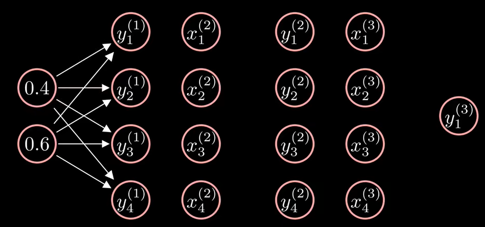
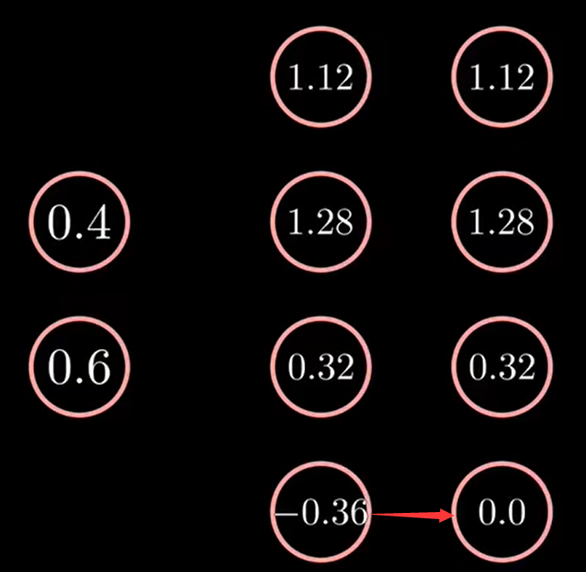
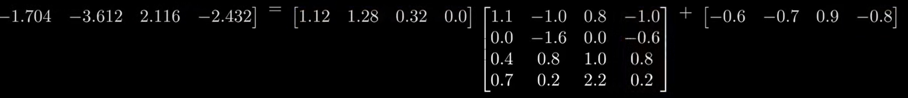
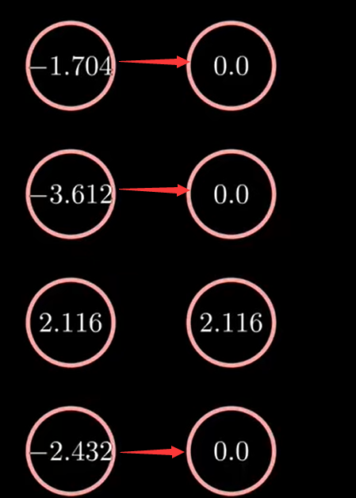
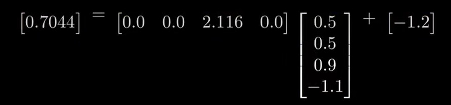
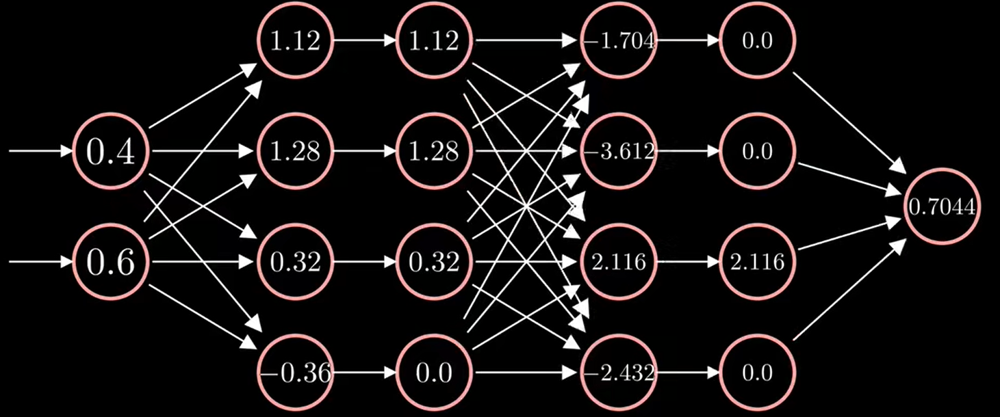

title: 前向传播Forward propagation
date: 2022-11-21 19:30:09
categories: Neural Network

plugins:

  - mathjax

tags: Neural Network
---

*前向传播算法就是：* ***将上一层的输出作为下一层的输入，并计算下一层的输出，一直**\*\*到运****算到输出层**\*\*为止*

在正式介绍前向传播前，先简单介绍计算图（Computational Graph）的概念。

$$
\mathrm{y}=\mathrm{w} * \mathrm{x}+\mathrm{b}
$$

可以用下面的有向无环图表示。

**假设一个三层的神经网络，有两个输入和一个输出，每一个层都是全连接层和激活函数层**

**第一层**输入为

$$
Y^{(1)}=X^{(1)} W^{(1)}+b^{(1)}
$$

$$
\left[\begin{array}{llll}y_{1,1}^{(1)} & y_{1,2}^{(1)} & y_{1,3}^{(1)} & y_{1,4}^{(1)}\end{array}\right]=\left[\begin{array}{ll}x_{1,1}^{(1)} & x_{1,2}^{(1)}\end{array}\right]\left[\begin{array}{llll}w_{1,1}^{(1)} & w_{1,2}^{(1)} & w_{1,3}^{(1)} & w_{1,4}^{(1)} \\ w_{2,1}^{(1)} & w_{2,2}^{(1)} & w_{2,3}^{(1)} & w_{2,4}^{(1)}\end{array}\right]+\left[\begin{array}{llll}b_{1,1}^{(1)} & b_{1,2}^{(1)} & b_{1,3}^{(1)} & b_{1,4}^{(1)}\end{array}\right]
$$

其中w和b的数值是神经网络通过学习得到的

之后我们可以得到第一层的输出，**第一全连接层的运算过程**

$$
\left[\begin{array}{llll}1.12 & 1.28 & 0.32 & -0.36\end{array}\right]=\left[\begin{array}{ll}0.4 & 0.6\end{array}\right]\left[\begin{array}{cccc}1.1 & -0.3 & -0.1 & -0.6 \\ -0.2 & 0.5 & 1.1 & -0.2\end{array}\right]+\left[\begin{array}{llll}0.8 & 1.1 & -0.3 & 0.0\end{array}\right]
$$

接着是激活函数层，激活函数用于提供非线性性，我们以**ReLU函数**为例

$$
y=\operatorname{ReLU}(x)=\left\{\begin{array}{ll}0, & x<0 \\ x, & x \geqslant 0\end{array}\right.
$$

**ReLU函数相当于保留正值,将负值强制置0**

**第二层**输出为

$$
Y^{(2)}=X^{(2)} W^{(2)}+b^{(2)}
$$

$$
\left[\begin{array}{lllll}y_{1,1}^{(2)} & y_{1,2}^{(2)} & y_{1,3}^{(2)} & y_{1,4}^{(2)}\end{array}\right]=\left[\begin{array}{llll}x_{1,1}^{(2)} & x_{1,2}^{(2)} & x_{1,3}^{(2)} & x_{1,4}^{(2)}\end{array}\right]\left[\begin{array}{cccc}w_{1,1}^{(2)} & w_{1,2}^{(2)} & w_{1,3}^{(2)} & w_{1,4}^{(2)} \\ w_{2,1}^{(2)} & w_{2,2}^{(2)} & w_{2,3}^{(2)} & w_{2,4}^{(2)} \\ w_{3,1}^{(2)} & w_{3,2}^{(2)} & w_{3,3}^{(2)} & w_{3,4}^{(2)} \\ w_{4,1}^{(2)} & w_{4,2}^{(2)} & w_{4,3}^{(2)} & w_{4,4}^{(2)}\end{array}\right]+\left[\begin{array}{llll}b_{1,1}^{(2)} & b_{1,2}^{(2)} & b_{1,3}^{(2)} & b_{1,4}^{(2)}\end{array}\right]
$$

x2的值由上一层的输出得到，最后得到第二全连接层的输出

在经过激活函数层

最后一层为输出层

$$
\left[\begin{array}{l}y_{1,1}^{(3)}\end{array}\right]=\left[\begin{array}{llll}x_{1,1}^{(3)} & x_{1,2}^{(3)} & x_{1,3}^{(3)} & x_{1,4}^{(3)}\end{array}\right]\left[\begin{array}{l}w_{1,1}^{(3)} \\ w_{2,1}^{(3)} \\ w_{3,1}^{(3)} \\ w_{4,1}^{(3)}\end{array}\right]+\left[b_{1,1}^{(3)}\right]
$$

最终输出为

这就是整个网络的**前向传播过程**

